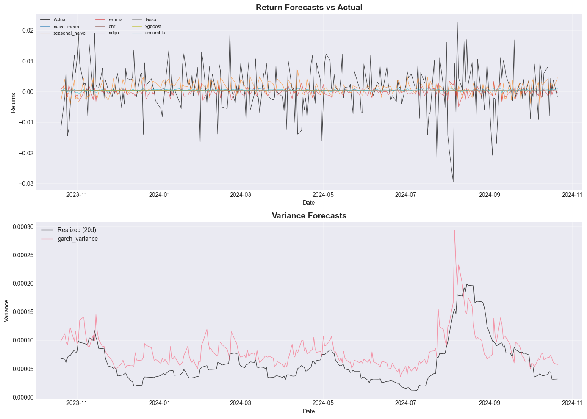
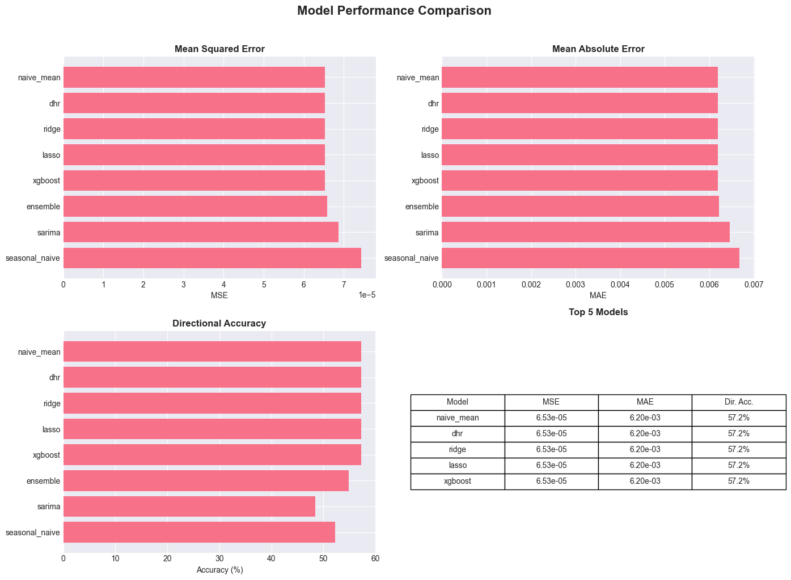
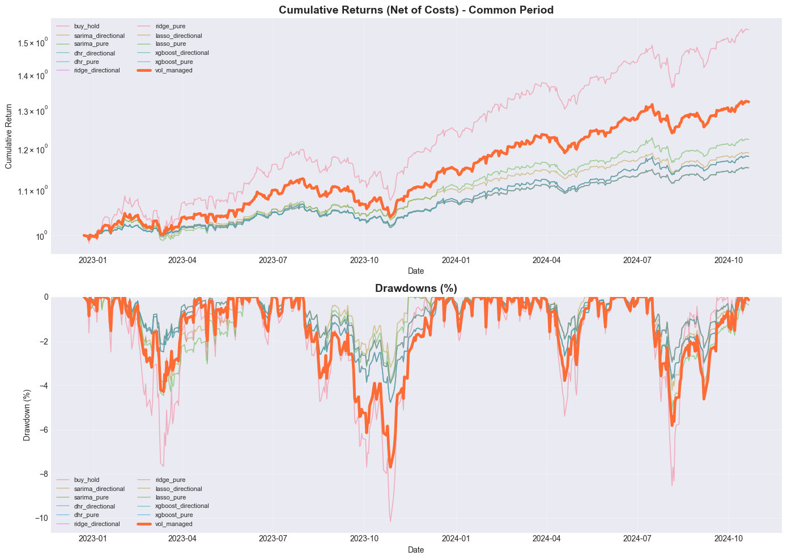
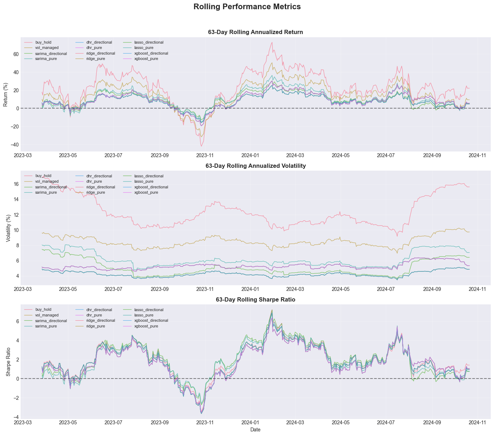
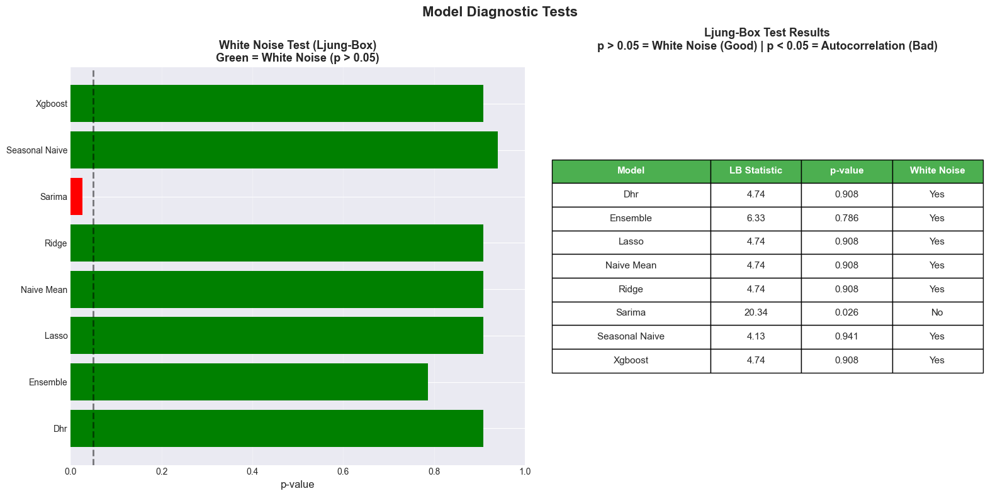
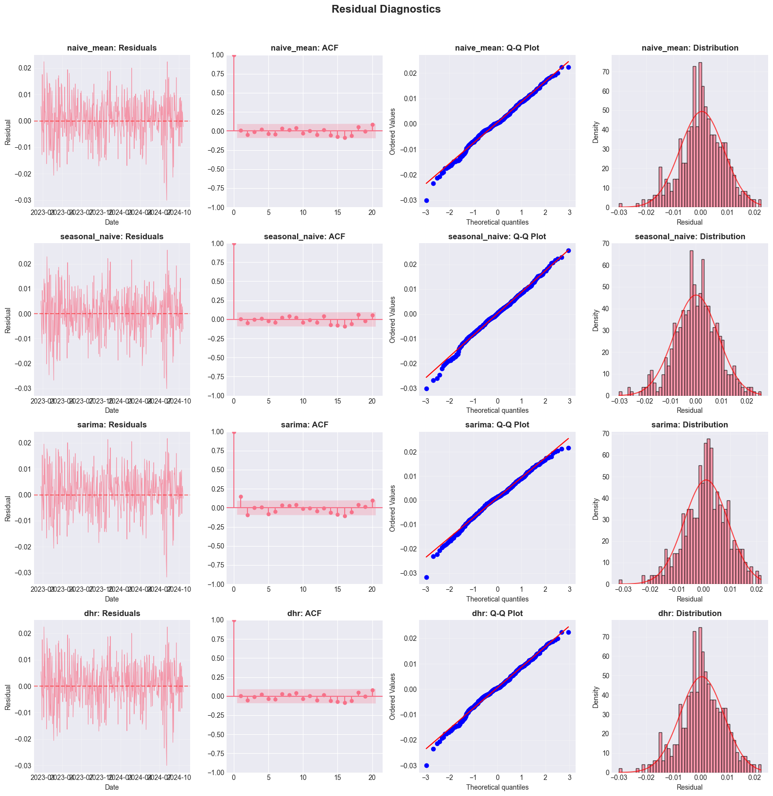
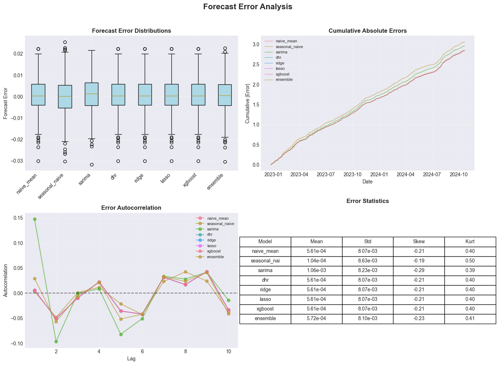
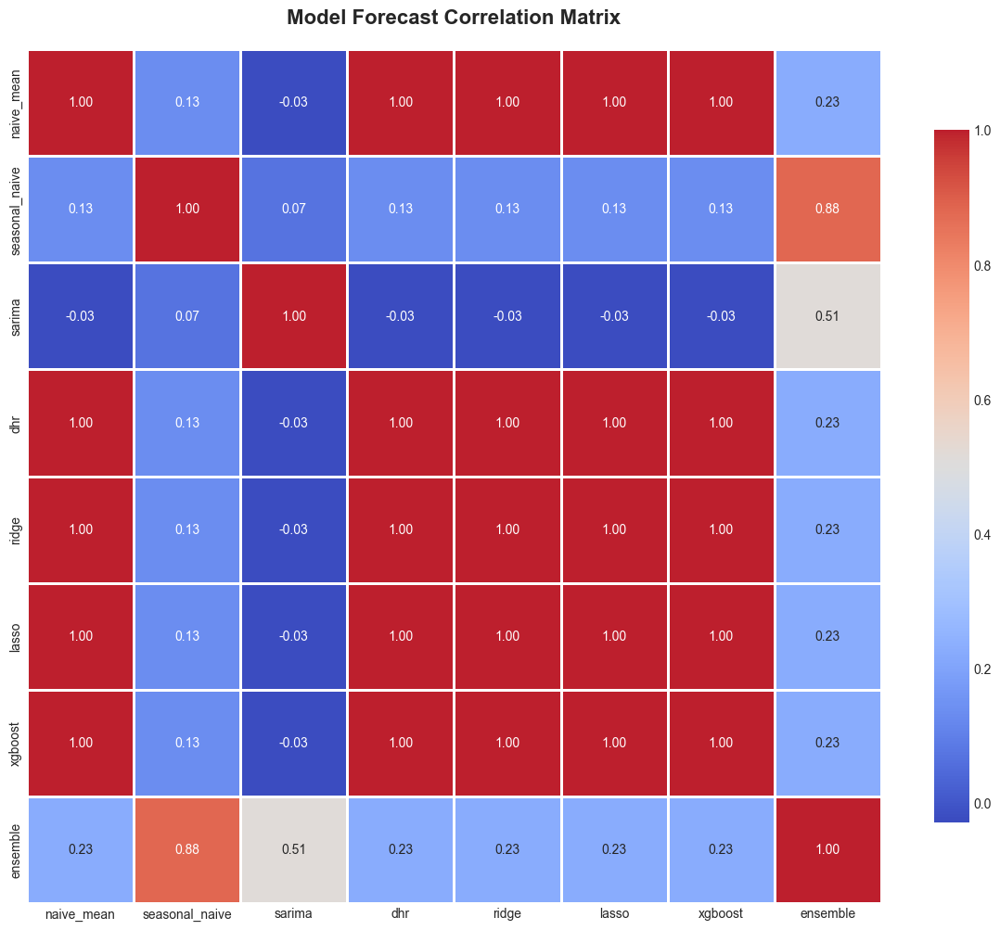

# Time-Series Forecasting and Risk-Managed Trading

## Overview

This project implements a comprehensive framework for forecasting daily asset returns and managing portfolio risk through volatility targeting. 

The project combines classical statistical models (GARCH, SARIMA) with modern machine learning approaches (Ridge, Lasso, XGBoost) to generate return forecasts for the S&P 500 ETF (SPY). These forecasts drive risk-managed trading strategies with realistic transaction costs.

### Goal

**Generate actionable trading signals and performance analytics from historical price data.**

Given daily price history for SPY (or any asset), this system:
1. Forecasts next-day returns using 8 different models
2. Predicts volatility using GARCH for risk management
3. Constructs volatility-targeted trading strategies with realistic costs
4. Evaluates forecast accuracy and strategy performance
5. Validates models using rigorous statistical diagnostics
6. Produces comprehensive visualizations and reports for analysis

**Key Features:**
- 8 forecasting models spanning statistical and machine learning approaches
- Rigorous statistical diagnostics (stationarity, autocorrelation, forecast comparison)
- Volatility-targeted position sizing with configurable risk limits
- Expanding window cross-validation to avoid look-ahead bias
- Comprehensive visualization and reporting suite
- Reproducible pipeline with deterministic random seeds

### System Architecture

```
INPUT                           PIPELINE                         OUTPUT
-----                           --------                         ------

Historical                   1. Data Loading
Price Data      --------->      - Load CSV
(SPY daily)                     - Compute log returns
                                - Validate dates
                                        |
                                        v
                             2. Feature Engineering
                                - Lagged returns
                                - Calendar effects
                                - Volatility proxies
                                - (Optional: IV data)
                                        |
                                        v
                             3. Model Forecasting
                                - GARCH (volatility)
                                - SARIMA (seasonal)    ------>  forecasts.csv
                                - Ridge/Lasso (ML)             forecasts.png
                                - XGBoost (ML)                 model_compare.png
                                - DHR (harmonic)
                                - Ensemble
                                        |
                                        v
                             4. Strategy Construction
                                - Volatility targeting
                                - Position sizing      ------>  strategy_returns.csv
                                - Transaction costs            strategy_cumulative.csv
                                - Leverage caps                equity_curves.png
                                        |                      rolling_performance.png
                                        v
                             5. Statistical Validation
                                - ADF tests (stationarity)
                                - Ljung-Box tests      ------>  diagnostics.png
                                  (white noise)                residual_diagnostics.png
                                - Diebold-Mariano
                                  (forecast comparison)
                                        |
                                        v
                             6. Performance Analysis
                                - Sharpe/Sortino
                                - Max drawdown         ------>  report.txt
                                - Forecast errors              correlation_heatmap.png
                                - Model comparison             forecast_errors.png
                                        |
                                        v
                             7. Output Generation
                                - 8 visualization plots
                                - CSV files (returns, forecasts)
                                - JSON bundle (results_bundle.json)
                                - Text report (report.txt)
```

### Data Flow

```
Price Data (P_t)
    |
    v
Log Returns (r_t = log(P_t/P_{t-1}))
    |
    +------------------+------------------+
    |                  |                  |
    v                  v                  v
GARCH Model      ML Models          SARIMA Model
(variance)       (Ridge/Lasso/XGB)  (seasonal)
    |                  |                  |
    v                  v                  v
Volatility       Return Forecasts    Return Forecasts
Forecast         (r_hat_{t+1})       (r_hat_{t+1})
(sigma_hat_t)           |                  |
    |                   +------------------+
    |                            |
    v                            v
Position Sizing  <----  Ensemble Forecast
(w_t = sigma_target/sigma_hat_t * sign(r_hat))
    |
    v
Strategy Returns (gross_return_t = r_t * w_{t-1})
    |
    v
Net Returns (net_return_t = gross_return_t - costs_t)
    |
    v
Performance Metrics (Sharpe, Drawdown, etc.)
```

## Visual Results

### Forecast Performance


*Figure 1: Return and variance forecasts. Top panel shows 8 models' return predictions vs actual. Bottom panel compares GARCH variance forecasts (pink) against realized 20-day variance (black), demonstrating the model's ability to track volatility dynamics.*


*Figure 2: Comparative forecast accuracy across models using MSE, MAE, and directional accuracy metrics. The leaderboard table shows top 5 performers.*

### Strategy Performance


*Figure 3: Cumulative returns (top) and drawdowns (bottom) for all trading strategies over the common evaluation period. Volatility-managed strategy (orange) achieves superior risk-adjusted returns with controlled drawdowns. All curves rebased to 1.0 at start of common period for fair comparison.*


*Figure 4: 63-day rolling metrics showing evolution of annualized returns, volatility, and Sharpe ratios. Demonstrates strategy adaptation to changing market conditions including the COVID-19 crash and recovery.*

### Model Diagnostics


*Figure 5: Statistical tests for model residuals. Left panel shows Ljung-Box test p-values (green = white noise residuals, red = autocorrelation detected). Right table displays detailed statistics - most models pass white noise test (p > 0.05), indicating well-specified models.*


*Figure 6: Comprehensive residual analysis for top 4 models showing time series plots, autocorrelation functions (ACF), Q-Q plots, and distribution histograms. Ideal residuals are uncorrelated and normally distributed.*

### Forecast Analysis


*Figure 7: Distribution and time series of forecast errors across models. Box plots reveal error spread and outliers, while time series shows temporal patterns in prediction mistakes.*


*Figure 8: Cross-correlation matrix of model forecasts. High correlations (red) indicate models capture similar patterns; low correlations (blue) suggest complementary information, justifying ensemble approaches.*

## Mathematical Foundation

### 1. Time Series Fundamentals

#### Log Returns

Asset returns are computed as log differences in prices:

$$r_t = \log(P_t) - \log(P_{t-1})$$

where $P_t$ is the closing price at time $t$. Log returns are approximately equal to percentage returns for small changes, but offer superior statistical properties (time-additivity, approximate normality).

**Why log returns?**
- Additive across time: $r_{t-k,t} = \sum_{s=t-k}^{t} r_s$
- Symmetric treatment of gains and losses
- Closer to normal distribution than simple returns

#### Stationarity

A time series ${r_t}$ is **weakly stationary** if:

$$\mathbb{E}[r_t] = \mu \quad \text{(constant mean)}$$
$$\text{Var}(r_t) = \sigma^2 \quad \text{(constant variance)}$$
$$\text{Cov}(r_t, r_{t-k}) = \gamma_k \quad \text{(autocorrelation depends only on lag } k\text{)}$$

Most forecasting models assume stationarity. The **Augmented Dickey-Fuller (ADF)** test checks for unit roots (non-stationarity) by testing whether $\phi = 1$ in:

$$\Delta r_t = \alpha + (\phi - 1)r_{t-1} + \sum_{j=1}^p \beta_j \Delta r_{t-j} + \varepsilon_t$$

If $p$-value $< 0.05$, we reject the unit root hypothesis and conclude the series is stationary.

### 2. Forecasting Models

All models produce one-step-ahead forecasts $\hat{r}_{t+1|t}$ using information available at time $t$.

#### Naive Baselines

**Historical Mean:**
$$\hat{r}_{t+1|t}^{\text{naive}} = \frac{1}{t}\sum_{s=1}^{t} r_s$$

**Seasonal Naive (Day-of-Week):**
$$\hat{r}_{t+1|t}^{\text{seasonal}} = r_{t+1-5} \quad \text{(last week's return for same weekday)}$$

These provide simple benchmarks that sophisticated models must beat to justify their complexity.

#### GARCH(1,1) for Volatility

The **Generalized Autoregressive Conditional Heteroskedasticity (GARCH)** model captures volatility clustering:

$$r_t = \mu + \sigma_t \varepsilon_t, \quad \varepsilon_t \sim N(0,1)$$
$$\sigma_t^2 = \omega + \alpha \varepsilon_{t-1}^2 + \beta \sigma_{t-1}^2$$

where:
- $\omega > 0$ is the baseline variance
- $\alpha \geq 0$ captures reaction to shocks (ARCH effect)
- $\beta \geq 0$ captures persistence (GARCH effect)
- Stationarity requires $\alpha + \beta < 1$

**Interpretation:** Today's volatility depends on yesterday's squared return (shock) and yesterday's volatility (persistence). This captures the empirical fact that volatile periods cluster together.

#### SARIMA (Seasonal Autoregressive Integrated Moving Average)

**ARIMA(p,d,q)** combines three components:
- **AR(p):** Autoregression on past values
- **I(d):** Differencing to achieve stationarity
- **MA(q):** Moving average of past errors

$$\phi(B)(1-B)^d r_t = \theta(B)\varepsilon_t$$

where $B$ is the backshift operator ($Br_t = r_{t-1}$), $\phi(B) = 1 - \phi_1 B - \cdots - \phi_p B^p$, and $\theta(B) = 1 + \theta_1 B + \cdots + \theta_q B^q$.

**SARIMA** adds seasonal terms with period $s$ (e.g., $s=5$ for weekly patterns in daily data):

$$\Phi(B^s)\phi(B)(1-B^s)^D(1-B)^d r_t = \Theta(B^s)\theta(B)\varepsilon_t$$

Model orders are selected via grid search minimizing AIC (Akaike Information Criterion).

#### Regularized Regression

**Ridge Regression** minimizes:

$$\min_{\beta} \sum_{t=1}^{T} (r_t - \mathbf{x}_{t-1}^T \boldsymbol{\beta})^2 + \lambda ||\boldsymbol{\beta}||_2^2$$

**Lasso Regression** uses L^1 penalty for feature selection:

$$\min_{\beta} \sum_{t=1}^{T} (r_t - \mathbf{x}_{t-1}^T \boldsymbol{\beta})^2 + \lambda ||\boldsymbol{\beta}||_1$$

Features $\mathbf{x}_{t-1}$ include:
- Lagged returns: $r_{t-1}, r_{t-2}, \ldots, r_{t-p}$
- Volatility proxies: rolling std, EWMA variance
- Calendar effects: day-of-week, month, quarter dummies
- Optional: implied volatility from options data

The penalty parameter $\lambda$ is chosen via cross-validation to balance fit and complexity.

#### XGBoost: Gradient Boosting

**XGBoost** builds an additive ensemble of decision trees:

$$\hat{r}_t = \sum_{k=1}^{K} \eta \cdot f_k(\mathbf{x}_{t-1})$$

where each tree $f_k$ is fit to the residuals of previous trees, $\eta$ is the learning rate (shrinkage), and early stopping prevents overfitting. XGBoost handles non-linear relationships and interactions automatically.

#### Ensemble Method

Combine models using inverse-MSE weighting:

$$\hat{r}_{t+1|t}^{\text{ensemble}} = \sum_{m=1}^{M} w_m \hat{r}_{t+1|t}^{(m)}$$

where weights are inversely proportional to historical mean squared error:

$$w_m = \frac{\text{MSE}_m^{-1}}{\sum_{j=1}^M \text{MSE}_j^{-1}}, \quad \text{MSE}_m = \frac{1}{T}\sum_{t=1}^{T}(r_t - \hat{r}_{t|t-1}^{(m)})^2$$

This gives more weight to historically accurate models.

### 3. Risk Management & Position Sizing

#### Volatility Targeting

Target a constant annualized volatility $\sigma_{\text{target}}$ (e.g., 10%) by scaling positions inversely with forecasted volatility:

$$w_t = \frac{\sigma_{\text{target}}}{\hat{\sigma}_{t|t-1}} \cdot \text{sign}(\hat{r}_{t+1|t})$$

where $\hat{\sigma}_{t|t-1}$ is the GARCH volatility forecast. This ensures:
- Larger positions when volatility is low (stable markets)
- Smaller positions when volatility is high (turbulent markets)
- Constant risk exposure over time

Position size is clipped to $[-w_{\max}, w_{\max}]$ to prevent excessive leverage.

#### Transaction Costs

Realistic trading costs are modeled as basis points on turnover:

$$\text{Cost}_t = -\text{tc}_{\text{bps}} \cdot |w_t - w_{t-1}| \cdot \frac{1}{10000}$$

Default: 1 basis point (0.01%) per unit of turnover.

### 4. Performance Metrics

#### Sharpe Ratio

Risk-adjusted returns:

$$\text{Sharpe} = \frac{\bar{r} - r_f}{\sigma(r)} = \frac{\text{Mean excess return}}{\text{Volatility}}$$

where $r_f$ is the risk-free rate (typically set to 0 for SPY). Higher is better; values above 1.0 are considered excellent.

#### Maximum Drawdown

Largest peak-to-trough decline:

$$\text{MaxDD} = \max_{t \in [0,T]} \left( \frac{\max_{s \leq t} V_s - V_t}{\max_{s \leq t} V_s} \right)$$

where $V_t$ is the portfolio value. Measures worst-case loss from any historical peak.

#### Forecast Accuracy

- **MSE (Mean Squared Error):** $\frac{1}{T}\sum_{t}(r_t - \hat{r}_t)^2$ - penalizes large errors heavily
- **MAE (Mean Absolute Error):** $\frac{1}{T}\sum_{t}|r_t - \hat{r}_t|$ - more robust to outliers
- **R-squared:** $1 - \frac{\sum(r_t - \hat{r}_t)^2}{\sum(r_t - \bar{r})^2}$ - proportion of variance explained
- **Directional Accuracy:** $\frac{1}{T}\sum_{t} \mathbb{1}(\text{sign}(r_t) = \text{sign}(\hat{r}_t))$ - percent correct direction

### 5. Statistical Diagnostics

#### Ljung-Box Test

Tests for autocorrelation in residuals $\hat{\varepsilon}_t = r_t - \hat{r}_t$:

$$Q = T(T+2)\sum_{k=1}^{h} \frac{\hat{\rho}_k^2}{T-k} \sim \chi^2(h)$$

where $\hat{\rho}_k$ is the sample autocorrelation at lag $k$. We want $p > 0.05$ (fail to reject white noise).

#### Diebold-Mariano Test

Compares forecast accuracy between two models. Let $d_t = e_{1,t}^2 - e_{2,t}^2$ be the loss differential. Test:

$$\text{DM} = \frac{\bar{d}}{\sqrt{\text{Var}(\bar{d})}} \sim N(0,1)$$

If $|DM| > 1.96$ (95% confidence), models have significantly different accuracy.

## Installation

**Requirements:** Python 3.8+

```bash
# Clone repository
git clone https://github.com/yourusername/multi-ts.git
cd multi-ts

# Install package
pip install -e .
```

**Dependencies:** numpy, pandas, scipy, matplotlib, statsmodels, scikit-learn, xgboost, optuna, seaborn

## Quick Start

### 1. Fetch Data

```bash
cd data
python fetch_real_data_simple.py
cd ..
```

This downloads approximately 5,200 days of SPY data from Stooq (2005-present).

### 2. Run Analysis

```bash
# Basic run (2020-2024)
python -m multi_ts.cli --start 2020-01-01 --end 2024-10-21

# Fast mode (skip SARIMA which is slow)
python -m multi_ts.cli --start 2020-01-01 --end 2024-10-21 --lightweight true

# Specific models only
python -m multi_ts.cli --start 2020-01-01 --end 2024-10-21 --models "garch,xgb,ridge"

# Custom risk parameters
python -m multi_ts.cli --start 2020-01-01 --end 2024-10-21 --target_vol_ann 0.15 --tc_bps 5
```

### 3. View Results

All outputs are saved to `outputs/`:
- **Plots:** 8 comprehensive visualizations (see Visual Results section)
- **Data:** `forecasts.csv`, `strategy_returns.csv`, `strategy_cumulative.csv`
- **Report:** `report.txt` (comprehensive summary)
- **JSON:** `results_bundle.json` (comprehensive results in JSON format)

## CLI Arguments

| Argument | Type | Default | Description |
|----------|------|---------|-------------|
| `--start` | str | **Required** | Start date (YYYY-MM-DD) |
| `--end` | str | **Required** | End date (YYYY-MM-DD) |
| `--ticker` | str | SPY | Stock ticker symbol |
| `--target_vol_ann` | float | 0.10 | Target annualized volatility (10%) |
| `--w_max` | float | 2.0 | Maximum position weight/leverage |
| `--tc_bps` | float | 1.0 | Transaction costs in basis points |
| `--window_init_days` | int | 750 | Initial training window (days) |
| `--seed` | int | 42 | Random seed for reproducibility |
| `--lightweight` | str | false | Skip SARIMA (faster execution) |
| `--models` | str | All | Comma-separated list of models |
| `--iv_csv` | str | None | Path to implied volatility data (optional) |
| `--out` | str | ./outputs/ | Output directory |
| `--plots` | str | true | Generate plots |
| `--json_bundle` | str | true | Generate comprehensive results bundle in JSON |

## Project Structure

```
multi_ts/
├── README.md                 # This file
├── pyproject.toml            # Package configuration
├── .gitignore                # Git ignore rules
├── src/multi_ts/             # Source code
│   ├── cli.py                # Command-line interface
│   ├── config.py             # Configuration management
│   ├── dataio.py             # Data loading
│   ├── datatypes.py          # Core data structures
│   ├── forecast.py           # Model orchestration
│   ├── strategy.py           # Trading strategies
│   ├── evaluation.py         # Performance metrics
│   ├── models/               # Forecasting models
│   │   ├── garch.py          # GARCH(1,1) volatility
│   │   ├── sarima.py         # Seasonal ARIMA
│   │   ├── dhr.py            # Dynamic Harmonic Regression
│   │   ├── linear.py         # Ridge/Lasso regression
│   │   └── xgb.py            # XGBoost
│   ├── features/             # Feature engineering
│   │   ├── lags.py           # Lagged returns
│   │   ├── calendar.py       # Calendar effects
│   │   ├── fourier.py        # Fourier terms
│   │   └── iv_features.py    # Implied volatility
│   ├── diagnostics/          # Statistical tests
│   │   ├── stationarity.py   # ADF, KPSS tests
│   │   ├── whiteness.py      # Ljung-Box test
│   │   └── diebold_mariano.py # Forecast comparison
│   ├── pipelines/            # Orchestration
│   │   └── backtest.py       # Main pipeline
│   └── reporting/            # Output generation
│       ├── plots.py          # Matplotlib plots
│       ├── tables.py         # Summary tables
│       └── serialize.py      # JSON/CSV export
├── tests/                    # Unit tests
├── data/                     # Data directory
│   ├── fetch_real_data_simple.py
│   └── generate_sample_data.py
├── outputs/                  # Results (generated)
└── archives/                 # Archived materials
```

## Implementation Details

### Type Safety
All functions use complete type hints. Core data structures are frozen dataclasses for immutability.

### Reproducibility
- Random seeds set throughout (numpy, sklearn, xgboost)
- Deterministic cross-validation folds
- XGBoost configured for single-threaded execution
- Matplotlib forced to "Agg" backend (headless)

### No Look-Ahead Bias
- Expanding window: each forecast uses only past data
- Features constructed with proper lag alignment
- GARCH variance forecast uses $\hat{\sigma}_{t+1|t}^2$, not realized $\sigma_{t+1}^2$

### Error Handling
- Graceful degradation with fallback parameters
- Data validation at each pipeline stage
- Warnings for failed GARCH/SARIMA convergence

## References

1. Hamilton, J. D. (1994). *Time Series Analysis*. Princeton, NJ: Princeton University Press.
2. Hastie, T., Tibshirani, R., & Friedman, J. (2009). *The Elements of Statistical Learning: Data Mining, Inference, and Prediction* (2nd ed.). New York: Springer.
3. Hull, J. C. (2022). *Options, Futures, and Other Derivatives* (11th ed.). Upper Saddle River, NJ: Pearson.
4. James, G., Witten, D., Hastie, T., & Tibshirani, R. (2021). *An Introduction to Statistical Learning with Applications in R* (2nd ed.). New York: Springer.
5. Shreve, S. E. (2004). *Stochastic Calculus for Finance I: The Binomial Asset Pricing Model*. New York: Springer.
6. Shreve, S. E. (2004). *Stochastic Calculus for Finance II: Continuous-Time Models*. New York: Springer.


## License

MIT License - see LICENSE file for details.


## Generative AI

AI assistance was used in the creation of this repository.